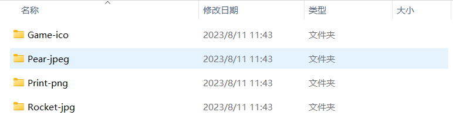
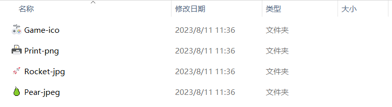

# win folder icon

**🔥Windows 文件夹图标工具🔥**

## 📦 功能

+ 将文件夹图标修改为指定图标
+ 将文件夹图标恢复为系统默认图标

## 👇 效果

**图标文件**


**文件夹默认图标**



**修改图标后的文件夹**



## 📖 使用

```shell
# python3 环境
# 下载库
git clone ...

# 加载依赖
pip install -r requirements.txt -i ...

# 显示帮助信息
python main.py [-h]

# 选择对应模式
python main.py {edit,recover} ...
```

## 🔗 常用命令

```shell
# 修改图标且文件夹不存在时自动创建
python main.py edit -m
# 恢复图标
python main.py recover
```

## ⚡ 注意

**修改后可能不会立马生效, 请等待一会或刷新文件夹**